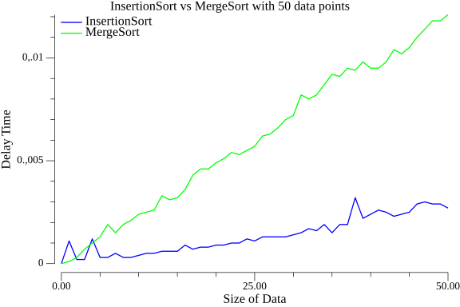
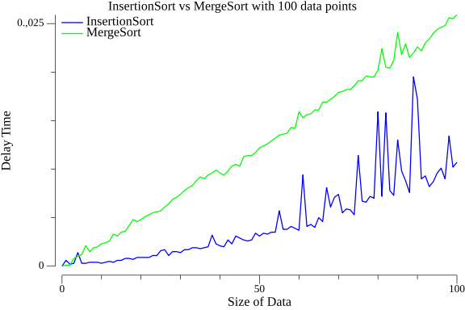
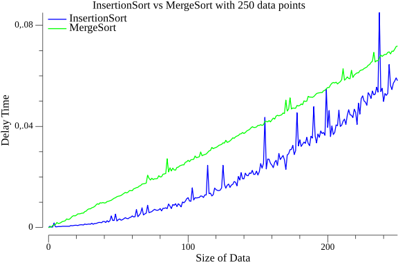
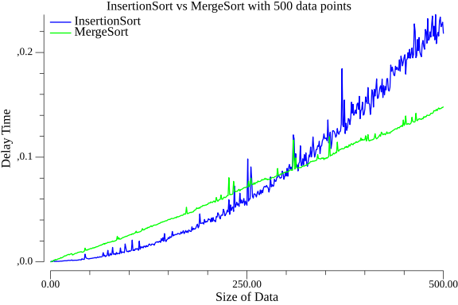
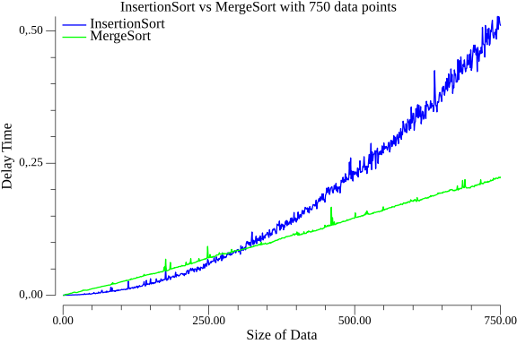
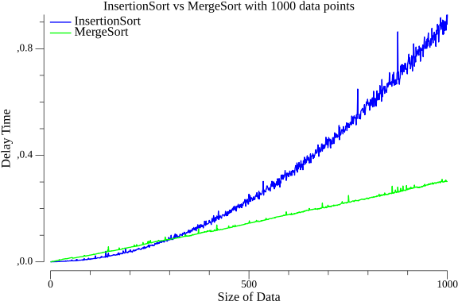
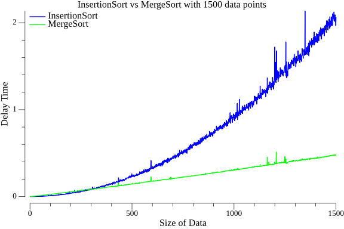
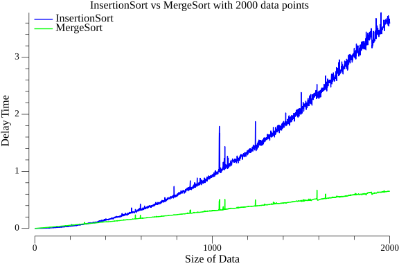
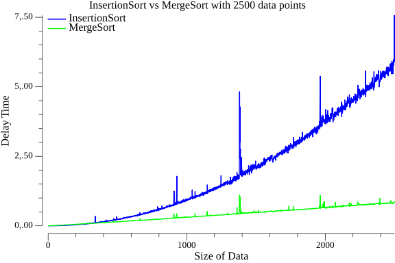

# Sorting Algorithms: Insertion Sort vs. Merge Sort [ENG]

## Introduction

Sorting algorithms are essential tools in computer science and data processing. They allow us to arrange data in a specific order, making it easier to search, retrieve, and analyze information. Two commonly used sorting algorithms are **Insertion Sort** and **Merge Sort**, each with its own characteristics, advantages, and disadvantages. In this article, we will explore these sorting algorithms, analyze their time complexity in Big-O notation, and highlight the differences between them.

## Insertion Sort

### Time Complexity (Big-O):
- Best Case: O(n)
- Average Case: O(n^2)
- Worst Case: O(n^2)

### Overview:
Insertion Sort is a simple and efficient comparison-based sorting algorithm. It works by repeatedly dividing the input into a sorted and an unsorted region. In each iteration, it takes an element from the unsorted region and places it in the correct position within the sorted region. This process continues until the entire array is sorted.

## Merge Sort

### Time Complexity (Big-O):
- Best Case: O(n log n)
- Average Case: O(n log n)
- Worst Case: O(n log n)

### Overview:
Merge Sort is a divide-and-conquer sorting algorithm. It divides the input array into smaller subarrays, recursively sorts them, and then merges the sorted subarrays back together. Merge Sort is known for its stability and consistent performance, making it suitable for sorting large datasets efficiently.

## Differences between Insertion Sort and Merge Sort

- **Time Complexity**: Merge Sort has a better time complexity than Insertion Sort in most cases. While Insertion Sort has a worst-case time complexity of O(n^2), Merge Sort maintains O(n log n) time complexity even in the worst case.

- **Stability**: Both algorithms are stable, meaning that equal elements retain their relative order in the sorted output. This property is important in some applications.

- **Efficiency**: For small datasets, Insertion Sort can be more efficient than Merge Sort due to its lower overhead. Merge Sort's recursive nature can lead to higher memory usage.

- **Applications**: Insertion Sort is practical for small arrays and nearly sorted data, while Merge Sort excels in sorting large datasets efficiently.

## Examples by Data Size

### Data Size: 50

### Data Size: 100

### Data Size: 250

### Data Size: 500

### Data Size: 750

### Data Size: 1000

### Data Size: 1500

### Data Size: 2000

### Data Size: 2500

---

# Algoritmos de Ordenamiento: Insertion Sort vs. Merge Sort [ESP]

## Introducción

Los algoritmos de ordenamiento son herramientas esenciales en la informática y el procesamiento de datos. Nos permiten organizar los datos en un orden específico, facilitando la búsqueda, recuperación y análisis de información. Dos algoritmos de ordenamiento comúnmente utilizados son **Insertion Sort** y **Merge Sort**, cada uno con sus propias características, ventajas y desventajas. En este artículo, exploraremos estos algoritmos de ordenamiento, analizaremos su complejidad temporal en notación Big-O y destacaremos las diferencias entre ellos.

## Insertion Sort

### Complejidad Temporal (Big-O):
- Mejor Caso: O(n)
- Caso Promedio: O(n^2)
- Peor Caso: O(n^2)

### Descripción:
Insertion Sort es un algoritmo de ordenamiento simple y eficiente basado en comparaciones. Funciona dividiendo repetidamente la entrada en una región ordenada y una región desordenada. En cada iteración, toma un elemento de la región desordenada y lo coloca en la posición correcta dentro de la región ordenada. Este proceso continúa hasta que todo el arreglo esté ordenado.

## Merge Sort

### Complejidad Temporal (Big-O):
- Mejor Caso: O(n log n)
- Caso Promedio: O(n log n)
- Peor Caso: O(n log n)

### Descripción:
Merge Sort es un algoritmo de ordenamiento basado en la técnica "divide y conquistar". Divide el arreglo de entrada en subarreglos más pequeños, los ordena recursivamente y luego fusiona los subarreglos ordenados. Merge Sort se destaca por su estabilidad y rendimiento consistente, lo que lo hace adecuado para ordenar grandes conjuntos de datos de manera eficiente.

## Diferencias entre Insertion Sort y Merge Sort

- **Complejidad Temporal**: En la mayoría de los casos, Merge Sort tiene una mejor complejidad temporal que Insertion Sort. Mientras que Insertion Sort tiene una complejidad temporal en el peor caso de O(n^2), Merge Sort mantiene una complejidad temporal de O(n log n) incluso en el peor caso.

- **Estabilidad**: Ambos algoritmos son estables, lo que significa que los elementos iguales conservan su orden relativo en la salida ordenada. Esta propiedad es importante en algunas aplicaciones.

- **Eficiencia**: Para conjuntos de datos pequeños, Insertion Sort puede ser más eficiente que Merge Sort debido a su menor sobrecarga. La naturaleza recursiva de Merge Sort puede dar lugar a un mayor uso de memoria.

- **Aplicaciones**: Insertion Sort es práctico para matrices pequeñas y datos casi ordenados, mientras que Merge Sort se destaca en la ordenación eficiente de grandes conjuntos de datos.

## Ejemplos por Tamaño de Datos

### Tamaño de Datos: 50

### Tamaño de Datos: 100

### Tamaño de Datos: 250

### Tamaño de Datos: 500

### Tamaño de Datos: 750

### Tamaño de Datos: 1000

### Tamaño de Datos: 1500

### Tamaño de Datos: 2000

### Tamaño de Datos: 2500
